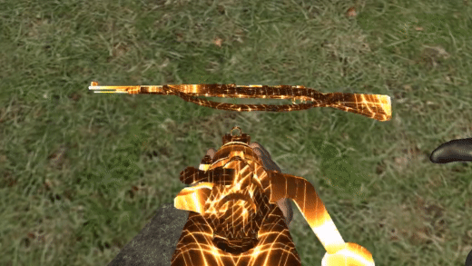
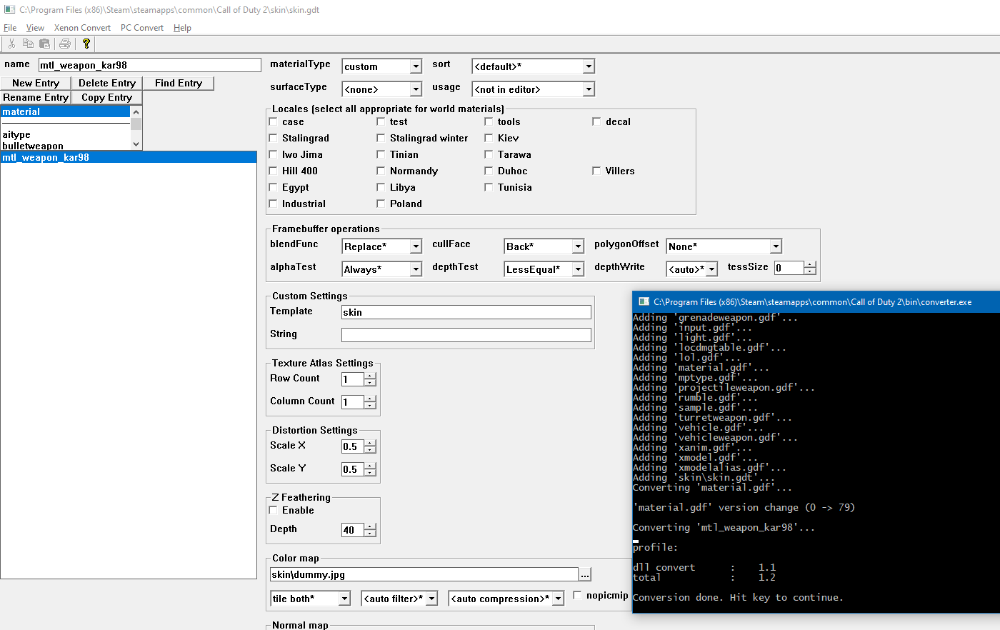
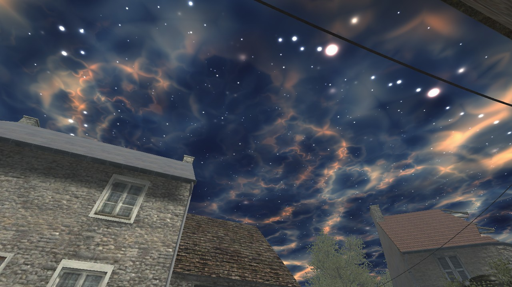
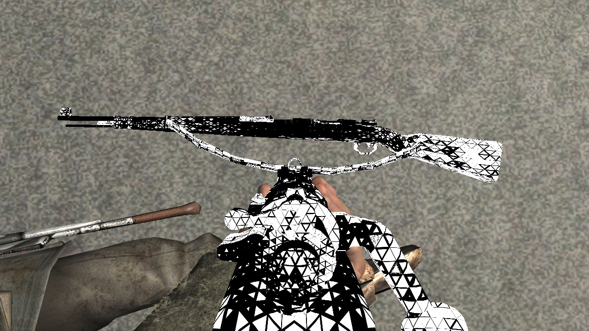

# Call of Duty 2 - Shaders

## ⭐ Follow along here ⇨ https://www.youtube.com/watch?v=RoDAiozmqNc

[](https://www.youtube.com/watch?v=RoDAiozmqNc)

---

I got all this information from xoxor4d, he does amazing stuff for CoD4: [xoxor4d.github.io](https://xoxor4d.github.io/tutorials/hlsl-intro/)
Just wated to see if this also works in CoD2... it does.

---

Call of Duty 2 uses two rendering engines -- DirectX 7 and DirectX 9 and shaders are only supported in DX9.
So you are already using DX9, or force your players to do so (`r_rendererPreference "dx9"` -- can cause crashes while witching). Otherwise shaders have no effect and aren't visible.

Sidenote: DirectX 7 shaders for CoD2 can be found in `CoD2/main/iw_07.iwd/materials_dx7`, however during my testing I have not yet discovered a way to work with them in a meaningful way.

That being said, lets start.

## Asset Manager

A minimalistic _template_ file looks like this (`CoD2/deffiles/materials/skin.template`):
```
refImage( "$colorMap$" );

#include "commonsetup.template"

techniqueSet( "skin" );

textureTable
{
	"colorMap" = map( "@tileColor@" ,
	                  "@filterColor@" ,
	                  "$colorMap$" ,
	                  @nopicmipColor@ )
		"@formatColor@" : "colorMap";
}
```
However, this only allows for a single shader to be created. You would have to create each file (also _templates_) for each different material over and over again.
Therefore, lets use a more flexible _template_ that can be modified with the _**string**_ field in the asset-manager.

Open up your asset manager (`CoD2/bin)` and create a new ___material___ entry named `mtl_weapon_kar98` with the following properties:
- materialType: custom
- surfaceType: none
- template: skin
- string: gold
- Color Map: a dummy _power-of-2_ image

everything else can stay default. Export your material.



Some entries in the template and the following techniquesets/techniques files are probably not neccessarily needed, however it worked with these ones. I didn't want to waste time on undocumented CoD specific formats, I am more interested in the actual shading part, so lets set up just this.

## For your iwd file

Create `CoD2/your_mod_folder/materials/techniquesets/skin_gold.techset`:
```
"fakelight normal":
"fakelight view":
"shaded wireframe":
"solid wireframe":
"debug bumpmap":
"depth prepass":
"build floatz":
"unlit no fog":
"unlit linear fog":
"unlit exp fog":
"lightmap no fog":
"lightmap linear fog":
"lightmap exp fog":
"lightprobe no fog":
"lightprobe linear fog":
"lightprobe exp fog":
"lightprobe smodel no fog":
"lightprobe smodel linear fog":
"lightprobe smodel exp fog":
"lightprobe smodel cached no fog":
"lightprobe smodel cached linear fog":
"lightprobe smodel cached exp fog":
"pointlight no fog":
"pointlight linear fog":
"pointlight exp fog":
"shadowcookie caster":
"shadowcookie receiver":
	skin_gold;
```

___TODO___ test, what is actually needed (fakelight for radiant/debug etc)

These states all reference the _skin technique_, so create it as well: `CoD2/your_mod_folder/materials/techniques/skin_gold.tech`:

```
{
	stateMap "nofog";

	vertex.position = code.position;
	vertex.color[0] = code.color;
	vertex.texcoord[0] = code.texcoord[0];

	vertexShader 2.0 "skin_gold.hlsl"
	{
	}

	pixelShader 2.0 "skin_gold.hlsl"
	{
		colorMapSampler = material.colorMap;
	}
}
```
Here the actual HLSL shaders are referenced. Make sure to use version 2.0, as with version 1.1 there are even more limitations to fight against.

**It seems like version 3.0 also works**

Now to the actual fun part, the shader. Create `CoD2/your_mod_folder/materials/shader/skin_gold.hlsl`:

```
#define USE_DETAIL		0

#include "lib/globals.hlsl"

#define OFFSET_VERTEX_TO_EYE_DISTANCE 10

#ifdef PIXEL_FOG
#define	FOGVAR texCoords.z
typedef float3 tcType;
#else
#define	FOGVAR fog
typedef float2 tcType;
#endif

struct VertexInput
{
	float4 position : POSITION;
	float4 color : COLOR;
	float2 texCoords : TEXCOORD0;
};

struct PixelInput
{
	float4 position : POSITION;
	float4 color : COLOR;
	tcType texCoords : TEXCOORD0;
#if USE_FOG && !defined( PIXEL_FOG )
	float fog : FOG_SEMANTIC;
#endif
};

struct PixelOutput
{
	float4 color : COLOR;
};

#include "lib/transform.hlsl"
#include "lib/fog.hlsl"
#include "lib/shade.hlsl"
#include "lib/texscroll.hlsl"

PixelInput vs_main( const VertexInput vertex )
{
	PixelInput pixel;

	pixel = (PixelInput)0;
	pixel.position = Transform_ObjectToClip( vertex.position );
#ifdef OFFSET_VERTEX_TO_EYE
	pixel.position.z -= OFFSET_VERTEX_TO_EYE_DISTANCE;
	float old_w = pixel.position.w;
	pixel.position.w -= OFFSET_VERTEX_TO_EYE_DISTANCE;
	if (old_w != 0)
	{
		pixel.position.x *= pixel.position.w/old_w;
		pixel.position.y *= pixel.position.w/old_w;
	}
#endif
	pixel.texCoords.xy = TexScroll( vertex.texCoords );
	pixel.color = vertex.color;

	Fog_VertexCalc( vertex, pixel );

	return pixel;
}

float rand( float2 uv )
{
    return frac( sin( dot( uv , float2( 12.9898 , 78.233 ) ) ) * 43758.5453 );
}

float2 uv2tri(float2 uv)
{
    float sx = uv.x - uv.y / 2.0;
    float offs = step( frac( 1.0 - uv.y ), frac( sx ) );

    return float2( floor( sx ) * 2.0 + offs , floor( uv.y ) );
}

PixelOutput ps_main( const PixelInput pixel )
{
	PixelOutput fragment;

    float scale = 40.0;
    float speed = 0.9;

    float2 uv = pixel.texCoords.xy * scale;

    float3 p = float3( dot( uv , float2( 1.0 , 0.5 ) ) , dot( uv , float2( -1.0 , 0.5 ) ) , uv.y );
    float3 p1 = frac( +p );
    float3 p2 = frac( -p );

    float d1 = min( min( p1.x , p1.y ) , p1.z );
    float d2 = min( min( p2.x , p2.y ) , p2.z );
    float d = min( d1 , d2 );

    float2 tri = uv2tri( uv );

    float r = rand( tri ) * 2.0 + tri.x / 16.0 + gameTime.w * speed * 2.0;
	float c = smoothstep( -0.02 , 0.0 , d - 0.2 * ( 1.0 + sin( r ) ) );

    fragment.color = float4( c , c , c , 1.0 );

	return fragment;
}

```

The vertex shader is not modifed (for now..) and the same as the original `materials/shader/lib/vertex_color_simple.hlsl`.
In the pixel shader you can now implement your weapon skin. I took this one from [glslsandbox.com](http://glslsandbox.com/e#66260.0), as it was easy to port over to HLSL.

Remember to put everyting in your iwd container:

- materials
	- shader/skin_gold.hlsl
	- technique/skin_gold.tech
	- techniquesets/skin_gold.techset
	- mtl_weapon_kar98

---

## Converting Shaders from GLSL to HLSL

- rename every `vec#` to `float#` (`vec3` becomes `float3`)
- rename every `mat#` to `float#x#` (`mat3` becomes `float3x3`)
- change some mismatching constructor arguments (`vec3( 0.0 )` becomes `float3( 0.0 , 0.0 , 0.0 )`)
- rename functions according to: https://anteru.net/blog/2016/mapping-between-HLSL-and-GLSL/
	- common ones are:
	- `fract()` to `frac()`
	- `mix()` to `lerp()`
	- `mod()` to `fmod()`
- adapt to the CoD2 pixelshader/vertexshader in- and output structure (`gl_FracColor` may become `fragment.color`)

## TODO

When in DX7 mode the engine complains it cannot find `skin_gold.tech` or something like that. You might need to copy a simple technique from `materials_dx7/` and rename it. 

## More Examples

[](https://www.youtube.com/watch?v=4rypaoLijeM)
[](https://www.youtube.com/watch?v=pG24Pw6Se_I)

